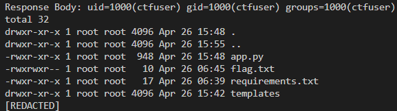

# Command Injection Exploit Demonstration

This repository contains a Python Flask application vulnerable to command injection and a Python script that exploits this vulnerability. The Flask application unsafely handles user input, which can be manipulated to execute arbitrary commands on the server.

### Files
- `app.py`: A Flask application with a command injection vulnerability.
- `exploit.py`: A script to exploit the vulnerability in `app.py`.

## Vulnerable Application (`app.py`)
The Flask application allows users to submit commands via a web form, which it attempts to execute on the server without proper input validation, except for removing spaces and blocking a couple of specific commands (`cat` and `rm`). This leads to a scenario where malicious users can inject additional commands.

### Key Vulnerability
The use of `subprocess.run` with `shell=True` and insufficient input sanitization creates a command injection vulnerability. Commands are only stripped of spaces, which allows special shell characters and other techniques to be used for crafting malicious input.

## Exploit Script (`exploit.py`)
The `exploit.py` script demonstrates how to exploit the command injection vulnerability in `app.py`. It sends a crafted payload that bypasses the input validation checks by using shell features to concatenate commands without spaces.

### How the Exploit Works
The payload leverages specific shell features to bypass the input validation in the Flask application that strips spaces from commands. It carefully constructs a command string using shell environment variables and special syntax to concatenate commands without spaces, executing multiple actions:

- **Setting a Special Environment Variable**:
  - `S=$'\n'`: This command sets an environment variable `S` to a newline character. In shell scripting, `$'\n'` is an escaped sequence that represents a newline. This variable `S` is used to manipulate the Internal Field Separator (`IFS`).

- **Using the Internal Field Separator (`IFS`)**:
  - `IFS` is a special variable in Unix-like operating systems that defines the characters used as field separators in command line input. By default, `IFS` includes space, tab, and newline.
  - `${IFS}`: The exploit uses `IFS` to separate different parts of the command. Since spaces are stripped by the application, setting `IFS` to only a newline allows other characters like semicolons and dashes to be interpreted as part of separate commands rather than options or arguments.

- **Executing Commands**:
  - `id;`: This command displays the user identity of the process running the Flask application. It is followed by a semicolon, which in shell scripting is used to separate commands.
  - `ls${IFS}-la;`: This constructs a command to list all files in the current directory in long format. Since `IFS` includes a newline, the `-la` is treated as a separate parameter to the `ls` command.
  - `head${IFS}flag.txt;`: This command outputs the first lines of the file named `flag.txt`. Again, using `${IFS}` ensures the command and its argument are treated as separate despite the lack of spaces.

These commands are concatenated into a single string and passed to the vulnerable application via the `cmd` parameter. Because `shell=True` is used in `subprocess.run`, the shell interprets the entire string and executes it as a series of commands, effectively bypassing the space removal and limited command filtering implemented in the Flask application.


## Usage

### Executing the Exploit
To run the exploit script, first ensure you have the `requests` library installed:
```bash
pip install requests
```
Then execute the script:
```bash
python exploit.py
python3 exploit.py
```
The script will send the payload to the vulnerable application and print the response, which includes the results of the injected commands.

